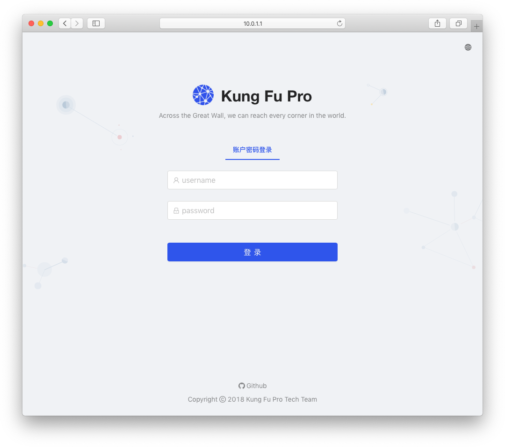
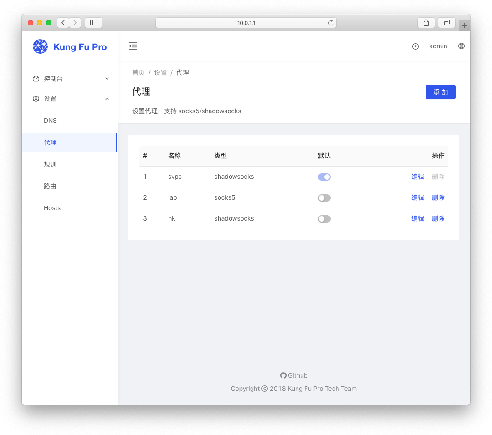

# Kung Fu Pro

> 一个灵活的代理解决方案
> 
> 通过 DNS 劫持，充当部分网段网关角色，通过 NAT 方式实现一机配置，让整个内网均能无感的使用代理。
> 相比传统方式效率更高性能更强，也更方便扩容。专为企业大内网环境设计，同时本身比较小巧，能在路由器运行，适合家用。
> 

## 目标人群

* **企业用户** <br>
  企业内部，由 IT 部门在网络层统一配置，实现部分部门或者整个内网科学上网，方便通过 Google 检索资料。<br>

* **家庭用户** <br>
  通过在路由器或者现有的 NAS、树莓派、小型工控机等方式，统一配置，实现内网所有设备，包括电视，电视盒子，手机等科学上网。

* **海外用户** <br>
  少量需要长期配置代理访问限制资源的用户。

* **其他** <br>
  同时需要使用多个代理的用户，例如：一个代理看 netflix, 另外一些代理用来访问 google，telegram 等

> 不适用：这是一个服务器软件，因此不适用直接在手机端运行。 <br>
> 例外：如果你使用的是 Mac 或者 linux 倒是直接可以在本机使用。windows 版本暂时不支持（也许以后会开发）。

## 预览
  管理界面登录
  
  代理配置
  
  规则配置
  

## 网络拓扑
  

## 安装
  基于 Go 语言开发，仅单个可执行文件，解压即用，更好的跨平台。
```bash
-rw-r--r--  1 clachlan978  staff   210B Dec  1 00:30 config.example.json
-rwxr-xr-x  1 clachlan978  staff    16M Dec  1 00:30 kungfu
drwxr-x---  2 clachlan978  staff    64B Dec  1 00:30 logs
```

## 配置

仅一个配置文件，参考 `config.example.json`，重命名为 `config.json`

```json
{
  "network": "10.86.0.1/16",
  "manage": {
    "address": "0.0.0.0:3001",
    "auth": {
      "admin": "123456"
    }
  }
}
```

network 表示经过劫持的 DNS 使用该网段 <br>
manage: 管理界面设置 <br>
  &nbsp;&nbsp;address: 为管理功能绑定的ip和端口号<br>
  &nbsp;&nbsp;auth: admin 为用户名，123456 为密码 （支持配置多个用户）

## 案例

### 企业实现统一科学上网

前提：

需要评估代理服务器带宽是否充足，条件允许，大陆用户建议选用香港服务器，选择高带宽，或者直接使用流量计费模式以获得更好的体验。

环境：

* 一台服务器，可以是虚拟机，Linux 2.2.x 以上内核 配置 4CPU 512M 以上内存， 100M 以上网卡 <br> 
  (条件允许，建议使用更高配置，使用千兆网络)
* 下载 KungFu linux 版本，修改 config.json 文件，并启动（需要 root 权限）。
* 修改路由器（或者3层交换）添加静态路由表，路由设置参考 config.json 文件中的配置。
* 修改内网 DHCP 服务器，设置下发 DNS 为上述部署 KungFu 的服务。
* 内网电脑，重连网络，检查 DHCP 是否生效
* 网络测试，尝试 `ping google.com` 是否已通

如果看到返回是和 config.json 中配置的网段一致，表示配置正确。
```bash
~# ping google.com
PING google.com (10.172.0.21) 56(84) bytes of data.
64 bytes from google.com (10.172.0.21): icmp_seq=1 ttl=60 time=0.306 ms
64 bytes from google.com (10.172.0.21): icmp_seq=2 ttl=60 time=0.229 ms
64 bytes from google.com (10.172.0.21): icmp_seq=3 ttl=60 time=0.323 ms
64 bytes from google.com (10.172.0.21): icmp_seq=4 ttl=60 time=0.323 ms
64 bytes from google.com (10.172.0.21): icmp_seq=5 ttl=60 time=0.324 ms
^C
--- google.com ping statistics ---
5 packets transmitted, 5 received, 0% packet loss, time 4098ms
rtt min/avg/max/mdev = 0.229/0.301/0.324/0.036 ms


~# traceroute google.com
traceroute to google.com (10.172.0.21), 30 hops max, 60 byte packets
 1  192.168.8.1 (192.168.8.1)  6.753 ms  7.655 ms  8.602 ms
 2  192.168.4.10 (192.168.4.10)  0.177 ms  0.162 ms  0.147 ms
 3  google.com (10.172.0.21)  0.202 ms  0.217 ms  0.236 ms
```

> 后续配置：合理划分 vlan，添加服务负载。


### 梅林系统（路由器）实现科学上网

实验环境：

* 华硕 RT-AC68U
* 固件 Merlin 384.5

步骤：
* 启用 jffs 脚本
* 启用 tun 设备， 修改 `/jffs/scripts/init-start` 文件，添加一行 
  `/sbin/modprobe tun`
* 关闭内置的 DNS 服务，但保留 DHCP 修改 `/jffs/configs/dnsmasq.conf.add`，添加一行 
  `port=0`
* 挂载一个移动硬盘或者 U 盘
  KungFu Pro 使用了存储，默认的 jffs2 文件系统不支持
* 将 KungFu Pro 拷贝到挂载的存储里，修改配置文件，然后启动即可

> 后续：设置开机启动，修改 `/jffs/configs/post-mount` 添加启动 KungFu Pro 脚本（命令）


### 树莓派实现小型局域网科学上网

前提：

需要路由器支持添加静态路由表。基本上几十块钱的 TP-Link 路由器都支持。

安装步骤：

参考 “企业实现统一科学上网”，只需要下载 arm 平台的包即可。

### ubnt EdgeRouter™ X 

ubnt ER-X 路由器是基于 linux mips 架构

* 设置路由器，开启 dnsmasq
* 设置 dnsmasq 添加 option `port=0` 关闭路由器内置的 DNS server
* sftp 或 scp 上传 `kungfu-vx.x.x.linux-mipsle.tar.gz` （目录随意，可以放 ubnt 家目录： /home/ubnt)
* 解压，修改 config.json, 然后 `sudo ./kungfu ` 启动服务
* 添加自动启动脚本，放到 `/config/scripts/post-config.d/` 目录即可，注意脚本需要有可执行权限

以上，kungfu pro 服务就搭建好了

> ubnt 其他系列是否支持，我们暂时没有实践。

## 故障排除

* 网络故障，不通，建议 tcpdump 抓包看看，是否数据包已抵达 Kung Fu Pro 所在服务器。
* 如何定位正在使用那个代理？<br>
  通过 dns 反查, 查看返回的 TXT 信息定位，到底走了哪个代理出去 <br>
  ```
  ~# dig -x 10.172.0.21

  ; <<>> DiG 9.11.3-1ubuntu1.2-Ubuntu <<>> -x 10.172.0.21
  ;; global options: +cmd
  ;; Got answer:
  ;; ->>HEADER<<- opcode: QUERY, status: NOERROR, id: 60044
  ;; flags: qr rd ra; QUERY: 1, ANSWER: 1, AUTHORITY: 0, ADDITIONAL: 1

  ;; QUESTION SECTION:
  ;21.0.172.10.in-addr.arpa.	IN	PTR

  ;; ANSWER SECTION:
  21.0.172.10.in-addr.arpa. 60	IN	PTR	google.com.

  ;; ADDITIONAL SECTION:
  google.com.		10	IN	TXT	"groupId:1, groupName:gfw, ruleId:1, ruleType:2, ruleValue:google, proxyId:4, proxyName:HkRackspaceSS"

  ;; Query time: 0 msec
  ;; SERVER: 10.172.0.1#53(10.172.0.1)
  ;; WHEN: Sat Dec 08 14:43:35 CST 2018
  ;; MSG SIZE  rcvd: 214
  ```

## License

> 这并不是一个完全免费的工具。
> 再次声明，本工具主要解决的痛点是代理的"最后一公里" -- 内网。
> 主要推荐在团队或者企业内部使用。
> 如果你是相关负责人，我们建议先做好相关测试/试用再考虑购买。

**价格方案**

| &nbsp; | Beta 版 | Trial 版 | Standard 版 | Professional 版 |
|--------|--------|---------|------------|----------------|
| 规则数    | 30 ~ 500  | 5       | 200        | 99999999       |
| 价格     | 免费     | 免费      | ￥89/年      | ￥199/年         |

> <small>Beta 版用于尝鲜，过期后降级为 Trail 版本。<br>
> 降级造成的规则条数超限，超限规则不会被删除，但会被停用。<br><br>
> Beta 版授权码不定期放出，规则数量不定。
></small>

**如何购买？**

微信转账后请邮件发送你的 `serverId` 至邮箱： `support@kungfu-pro.tk` <br>
可能由于时差关系，大概会在 1、2天内收到 License 激活码。小众软件，请谅解。

邮件模板：

```md
serverId: 035aee8838c937f0b748ecc19239507f61ede3fa
购买版本：Standard
付款方式：微信扫码
附： 支付截图
```


## 下载 & 更新

下载：https://github.com/kungfu-pro/kungfu-pro-issues/releases

> Tips: <small>点击 github 上的 watch 关注，即可获得更新通知。</small>

Beta License:
```plain
H4sIAAAAAAAA/wCgAV/+kD/DB12/kOn8X//b8b82kUaJmat5TDh5fGRSZuFg/OvNLL4gGT4IjyOZd6MTvARxD5G5drNLQ211ut9KIY0/OIM4awspy5X6QsSrY6JrqSU2QDuF19SmT9TmlmRf8ZUg0+5hj+VnUlI8W9SaBZ6jzdj1lDS3CRWyTkqp8lI8ZuuxCSiuEkxHpICeDl5wPChPjhr/crM2HM+SLFvMlTGRRO+A1vu1YXkjP7bOLMzBOlYyFIC8wbJBn+odmGrUs902yq6WkvnGH9QBYG9J985/xSOhNPCnTrgu4IGewml9b9bMQnoDd0upmXxhika1V4EV3xx30UxrytzTWf5rXoq6DkQG9c49s1SeXlPAWQOtZTA5ubZikBYvDe9du8/DFImiUW6AXCiRU+H5sD7hE9JLgxy/kl+uF8tZEOIhf3QcncpGq9ZZWJuEUkCSaoH7RlBx6NVbAr+bYoIlNts2wsvSEs65NwJrQwtk3BKWZskNkerWeHQAxk725ZI2uhzIaCdp+CU06dyvYH8WIhXxcN7A7JE1M6ddkc3ZW5NHvwB2DU8BAAD//9Xig8+gAQAAX01ea
```

## 沟通

Telegram: https://t.me/kungfupro


## FAQ

* 是否支持 UDP relay，如何确认我的配置已经工作良好? 
  > 目前仅 shadowsocks 代理协议支持 udp 转发（并且依赖服务端开启 udp relay)。
  你可以通过向 google 公共 DNS 服务器查询（注意，要用域名）任意域名的 A 记录。 来确认 KungFu 的 UDP relay 是工作的。 <br>
  例如执行 `dig @google-public-dns-a.google.com google.com`，如果工作正常，返回结果应该和你直接在代理服务器上执行的效果一致。

* 如何应对 DNS 污染？
  > 不需要额外处理，你只用关系规则的维护，符合规则的请求会自动规避 DNS 污染问题。

* 我们团队需要部署多个实例，我可以只购买一份 License 吗？
  > 可以，请和我们联系获取优惠。

* SSR 什么时候支持？
  > 用户大于2000 或者 tg 群超过 2000人。
  > 在我们看来目前增加混淆并不能降低封锁风险。如果你实在需要建议搭建中间件，在本软件中使用 socks5 协议。

* WireGuard, v2ray 有何计划？
  > 现在用户太少，目前没有动力迭代，请先用 socks5 顶一下。 -_-!!

## 附录

### 批量添加 gfwlist 规则

在浏览器 console 中执行如下代码，将转换结果，导入到规则

> 不是很建议这么做，很多规则对一般用户没有意义，我们建议你按需添加即可。

```javascript
(async (copy) => {
  const getHostname = (str) => {
    const a = document.createElement('a');
    a.href = str

    let hostname = a.hostname
    if (hostname.indexOf('%2A') !== -1) {
      const items = []
      for (const it of a.hostname.split('.')) {
        if (it.indexOf('%2A') !== -1) {
          continue
        }
        items.push(it)
      }
      hostname = items.join('.')
    }
    return hostname
  }

  console.log('获取中，请稍后……')
  const content = await fetch('https://raw.githubusercontent.com/gfwlist/gfwlist/master/gfwlist.txt')
  const body = await content.text()
  const plain = atob(body)
  const res = new Set()
  for (let line of plain.split(/\n/)) {
    line = line.trim()
    if (!line || line.startsWith('!')) {
      continue
    }

    if (line.startsWith('@@||')) {
      continue
    }

    if (line.startsWith('@@')) {
      continue
    }

    if (line.startsWith('/')) {
      continue
    }

    if (line.startsWith('||')) {
      res.add(line.substr(2))
      continue
    }

    if (line.startsWith('|http')) {
      res.add(getHostname(line.substr(1)))
      continue
    }

    if (line.startsWith('.')) {
      res.add(getHostname(`http://${line.substr(1)}`))
      continue
    }
  }

  const finals = []
  for (const it of res) {
    if (it.indexOf('.') === -1) {
      continue
    }

    if (it.indexOf('google') !== -1) {
      continue
    }

    if (/\d+\.\d+\.\d+\.\d+/ig.test(it)) {
      continue
    }

    finals.push(it)
  }

  copy(finals.join('\n'))
  console.log('Done! 规则已拷贝到剪切板，请前往规则设置，添加域名后缀规则吧。')
})(copy)
```
